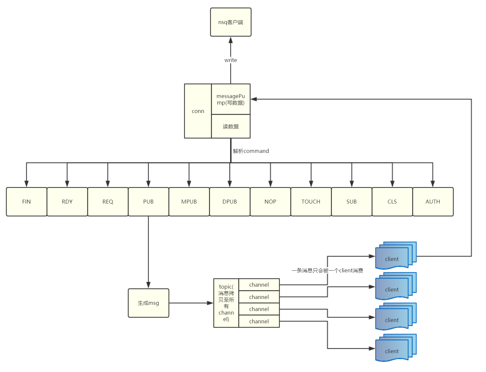

# nsq源码分析之nsqd篇


- [nsq源码分析之nsqd篇](#nsq%e6%ba%90%e7%a0%81%e5%88%86%e6%9e%90%e4%b9%8bnsqd%e7%af%87)
    - [名词解释](#%e5%90%8d%e8%af%8d%e8%a7%a3%e9%87%8a)
    - [架构设计](#%e6%9e%b6%e6%9e%84%e8%ae%be%e8%ae%a1)
    - [消息流转](#%e6%b6%88%e6%81%af%e6%b5%81%e8%bd%ac)
    - [命令](#%e5%91%bd%e4%bb%a4)
    - [传输协议](#%e4%bc%a0%e8%be%93%e5%8d%8f%e8%ae%ae)
    - [消息存储协议](#%e6%b6%88%e6%81%af%e5%ad%98%e5%82%a8%e5%8d%8f%e8%ae%ae)
    - [集群（nsqlookup）](#%e9%9b%86%e7%be%a4nsqlookup)

### 名词解释
+ topic：消息分组，一个topic既为一个消息分组，一个消息分组内可以包含多个频道。
+ channel：频道，在topic内部实现的逻辑概念。用户订阅topic实际上订阅的topic内部的频道。当topic接受client发布的消息后，会定位所在topic然后把消息下发给topic内部所有的channel。
+ rdy：nsq采用的消息推送方式(ready)。nsq并非直接的服务器推模型。客户端开始接收消息时会告知服务器想要接收的消息数量，然后服务器根据此参数定向推送特定数据给该client。
+ flight：在nsq中凡是推送到客户端的且未被finished的msg在nsqd消息所在的channel中被记作fligth。读者朋友阅读源码时当看到flight就要明白这条msg还没有被finished。

### 架构设计

### 消息流转



### 命令
nsq客户端与服务器端通信采用命令通信  
1. 客户端与服务器端约定支持的命令，然后由客户端封包命令数据包
2. 服务器端解包命令数据包并响应

nsqd支持的命令

| 命令  | 描述                                                              |
| :---- | :---------------------------------------------------------------- |
| FIN   | 消息消费成功                                                      |
| RDY   | 更新RDY计数器                                                     |
| REQ   | 消费端请求重新入列                                                |
| PUB   | 发布消息                                                          |
| MPUB  | 批量发布消息                                                      |
| DPUB  | 延迟发布，消息会先放入延时队列，延时到期后，进入消费队列          |
| NOP   | 空操作                                                            |
| TOUCH | 更新消息状态，被更新的消息会从flight和defer队列中移除，并重新放入 |
| SUB   | 订阅频道，新consumer连接时调用                                    |
| CLS   | 关闭consumer                                                      |
| AUTH  | 认证                                                              |


### 传输协议
1. 协议报文格式  
    [命令名][空格][参数1][空格][参数2]...[\n][消息长度][消息体]
    
    nsq客户端与服务器端采用tcp通信，为解决应用层黏包问题，不同数据包之间由换行"\n"分割。  
    命令名长度不固定，参数与命令名以及其他参数之间由空格分割，参数长度不固定。  
    换行符分割消息体，紧跟着换行符的是4字节消息长度，消息体。


2. 封包相关代码
    ```go
    // 代码以发布消息为例

    // Command结构体
    type Command struct {
        Name   []byte
        Params [][]byte
        Body   []byte
    }

    //构造“发布”命令结构体
    func Publish(topic string, body []byte) *Command {
        var params = [][]byte{[]byte(topic)}
        return &Command{[]byte("PUB"), params, body}
    }

    // 构造数据包写入net.Conn
    func (c *Command) WriteTo(w io.Writer) (int64, error) {
        var total int64
        var buf [4]byte

        // 第一步写入命令名
        n, err := w.Write(c.Name)
        total += int64(n)
        if err != nil {
            return total, err
        }

        // 第二步写入相关参数,不同参数之间由空格分割
        for _, param := range c.Params {
            n, err := w.Write(byteSpace)
            total += int64(n)
            if err != nil {
                return total, err
            }
            n, err = w.Write(param)
            total += int64(n)
            if err != nil {
                return total, err
            }
        }

        // 第3步写入换行符
        n, err = w.Write(byteNewLine)
        total += int64(n)
        if err != nil {
            return total, err
        }

        if c.Body != nil {
            bufs := buf[:]
            // 第4步写入body体长度
            binary.BigEndian.PutUint32(bufs, uint32(len(c.Body)))
            n, err := w.Write(bufs)
            total += int64(n)
            if err != nil {
                return total, err
            }
            // 第5步写入写入body数据
            n, err = w.Write(c.Body)
            total += int64(n)
            if err != nil {
                return total, err
            }
        }

        return total, nil
    }
    ```
3. 解包相关代码
    ```go
    // 代码以发布消息为例

    // 第一根据换行符读入数据头信息（命令名，参数等...）
    line, err = client.Reader.ReadSlice('\n')

    // 第二清洗数据构造params，params即为命令与参数组成的字节数组
    // trim the '\n'
    line = line[:len(line)-1]
    // optionally trim the '\r'
    if len(line) > 0 && line[len(line)-1] == '\r' {
        line = line[:len(line)-1]
    }
    params := bytes.Split(line, separatorBytes)
    var response []byte
    response, err = p.Exec(client, params)

    func (p *protocolV2) Exec(client *clientV2, params [][]byte) ([]byte, error) {
        ...
        switch {
        case bytes.Equal(params[0], []byte("FIN")):
            return p.FIN(client, params)
        case bytes.Equal(params[0], []byte("PUB")):
            return p.PUB(client, params)
        }
        ...
    }

    // 第三部解析剩余数据
    func (p *protocolV2) PUB(client *clientV2, params [][]byte) ([]byte, error) {
        ...
        topicName := string(params[1])
        ...
        // 读入4字节body长度
        bodyLen, err := readLen(client.Reader, client.lenSlice)
        ...
        // 读取body体
        messageBody := make([]byte, bodyLen)
	    _, err = io.ReadFull(client.Reader, messageBody)
    }
    ```


### 消息存储协议
1. 报文格式
    ```go
    // decodeMessage deserializes data (as []byte) and creates a new Message
    // message format:
    // [x][x][x][x][x][x][x][x][x][x][x][x][x][x][x][x][x][x][x][x][x][x][x][x][x][x][x][x][x][x]...
    // |       (int64)        ||    ||      (hex string encoded in ASCII)           || (binary)
    // |       8-byte         ||    ||                 16-byte                      || N-byte
    // ------------------------------------------------------------------------------------------...
    //   nanosecond timestamp    ^^                   message ID                       message body
    //                        (uint16)
    //                         2-byte
    //                        attempts
    ```
2. 封包相关代码
    ```go
    // 入口函数
    func writeMessageToBackend(buf *bytes.Buffer, msg *Message, bq BackendQueue) error {
        buf.Reset()
        _, err := msg.WriteTo(buf)
        if err != nil {
            return err
        }
        return bq.Put(buf.Bytes())
    }

    // 封包并写入net.Conn
    func (m *Message) WriteTo(w io.Writer) (int64, error) {
        var buf [10]byte
        var total int64

        binary.BigEndian.PutUint64(buf[:8], uint64(m.Timestamp))
        binary.BigEndian.PutUint16(buf[8:10], uint16(m.Attempts))

        n, err := w.Write(buf[:])
        total += int64(n)
        if err != nil {
            return total, err
        }

        n, err = w.Write(m.ID[:])
        total += int64(n)
        if err != nil {
            return total, err
        }

        n, err = w.Write(m.Body)
        total += int64(n)
        if err != nil {
            return total, err
        }

        return total, nil
    }
    ```

3. 解包相关代码
   ```go
    func decodeMessage(b []byte) (*Message, error) {
        var msg Message

        if len(b) < minValidMsgLength {
            return nil, fmt.Errorf("invalid message buffer size (%d)", len(b))
        }

        msg.Timestamp = int64(binary.BigEndian.Uint64(b[:8]))
        msg.Attempts = binary.BigEndian.Uint16(b[8:10])
        copy(msg.ID[:], b[10:10+MsgIDLength])
        msg.Body = b[10+MsgIDLength:]

        return &msg, nil
    }
   ```

### 集群（nsqlookup）
nsq的集群由nsqlookup提供服务发现, nsq开启集群需要nsqd启动时指定nsqlookup的网络地址。这样nsqd成功启动后，nsqlookup就保留了nsqd的节点信息。在集群模式下消费者需要订阅topic时只需要连接到nsqlookup，由nsqlookup查询topic所在节点，然后消费者直接和topic所在节点建立通信。nsqlookup在整个过程中保存节点信息，为消费者提供服务发现。  

需要注意的是生产者发布消息的话仍然需要连接到具体的实体节点，nsqlookup并不具备自动分发消息的能力。